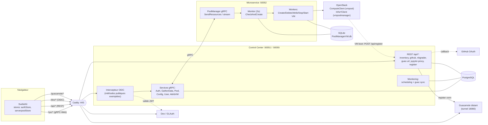
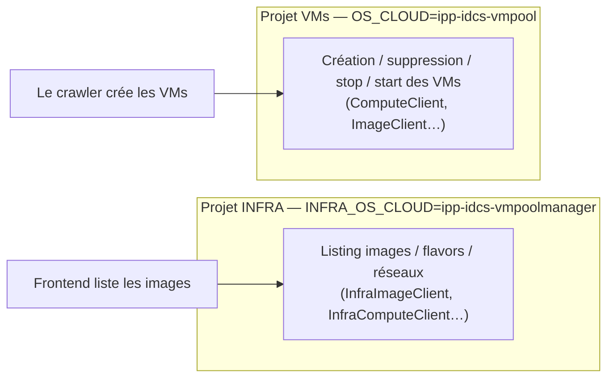

# Architecture générale

CloudPoolManager est un système **trois tiers** communiquant en **gRPC**, avec un reverse proxy
**Caddy** en façade et deux bases de données.

## Les services

| Service | Chemin | Ports | Rôle |
|---------|--------|-------|------|
| **Frontend** | `frontend/` | 5173 (dev Vite) | UI SvelteKit (enseignant + étudiant) |
| **Control Center** | `control_center/` | 50051 (gRPC), 50055 (gRPC-Web + REST) | Orchestration : users, pools, attribution, notation, inventaire |
| **Microservice OpenStack** | `microservices/openstack/` | 50052 (gRPC), 8080 (REST interne) | Provisionnement des VMs via gophercloud |
| **Caddy** | `caddy/` | 443 (HTTPS) | Reverse proxy : route gRPC-Web, REST, frontend |
| **Auth** | `auth/` (gitignored) | 3893 (LDAP), 5556 (OIDC) | GLAuth (LDAP) + Dex (OIDC/PKCE) |
| **Guacamole** | distant + tunnel | 18080 (tunnel local) | Terminal web (clientless RDP/SSH/VNC) |

## Schéma détaillé des flux

## Flux clés (résumé)

**Création de pool** — Frontend → `CreatePool` RPC → le Control Center stocke le pool en
PostgreSQL → envoie un `RessourceRequest` au microservice → job mis en file SQLite → un worker
appelle l'API OpenStack → la VM s'enregistre au boot via REST `/api/register` → l'état remonte
au frontend. Détails : [Création des pools](03-creation-pools.md).

**Attribution d'une VM** — `AttribVMinPool` RPC → on alloue une VM libre du pool → on injecte la
clé SSH de l'étudiant → renvoie IP + username. Détails : [Attribution](05-attribution-etudiants.md).

**Temps réel** — Le Control Center diffuse les changements via PostgreSQL `LISTEN/NOTIFY` ; le
frontend s'abonne et met à jour les stores Svelte.

## Les deux projets OpenStack ⚠️

C'est un point d'architecture **important** (source de plusieurs bugs).

- Le **frontend liste** les images depuis le projet **infra** (`vmpoolmanager`).
- Les **VMs sont créées** dans le projet **vmpool** (`OS_CLOUD`).
- ⚠️ Les **UUID d'images sont scopés par projet** : un UUID valide côté infra ne l'est pas
  forcément côté vmpool. Voir la résolution d'image dans
  [Provisionnement](04-provisionnement-reconciliation.md#résolution-de-limage).

Configuration : `models/client.go` (`CreateParams`, `initStudentClients`, `initInfraClients`).

## Définitions Proto

- `proto/frontcontrol.proto` — Frontend ↔ Control Center (`AuthService`, `GatherDataService`,
  `PoolService`, `ConfigService`, `UserService`, `AttribVMService`).
- `proto/poolmanager.proto` — Control Center ↔ Microservice (`PoolManager` : create/delete VMs,
  stream d'état, list resources).

Code généré : Go dans `*/pb/` et `control_center/frontcontrolpb/`, TypeScript dans
`frontend/src/lib/grpc/`.

## Bases de données

| BDD | Service | Contenu |
|-----|---------|---------|
| **PostgreSQL** | Control Center | pools, servers, users, configs, vm_instances (registrar), sessions GitHub, image_proposals |
| **SQLite** (`PoolManagerVM.db`) | Microservice | file d'attente de jobs + miroir local des pools/servers |

Schéma d'auto-enregistrement des VMs : `sql/registrar_schema.sql`.

⚠️ Le Control Center charge `control_center/.env` **en priorité** (puis `../.env` en repli) —
voir [Développement](09-developpement-exploitation.md#les-deux-env).
