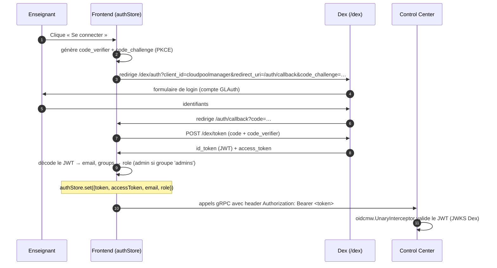
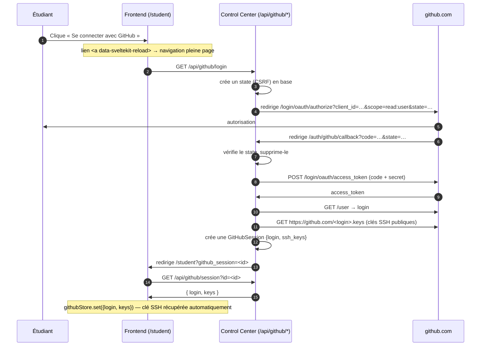
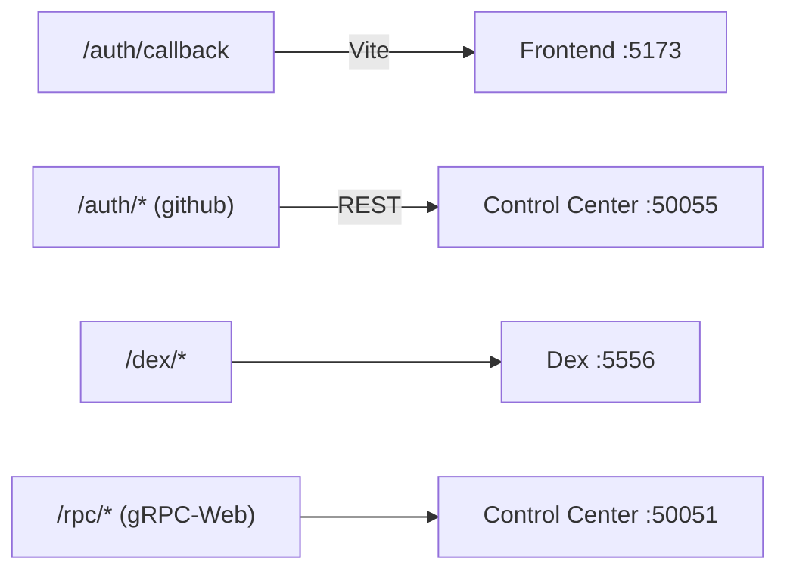

# Authentification & connexion

Il y a **deux** mécanismes d'authentification distincts :

| Public | Méthode | Usage |
|--------|---------|-------|
| **Enseignants / admins** | OIDC (Dex + GLAuth) avec PKCE | Accès à toute l'interface d'administration |
| **Étudiants** | OAuth GitHub | Récupération automatique de la clé SSH publique pour accéder à leur VM |

## 1. Connexion enseignant (OIDC / Dex)

Dex (`auth/dex.yaml`) est le fournisseur OIDC ; GLAuth (`auth/glauth.cfg`) est l'annuaire LDAP
des comptes. Le frontend fait un flux **Authorization Code + PKCE**.

**Points clés :**
- Le rôle est déduit des `groups` du JWT : `admins` → `admin`, sinon `student`
  (`frontend/src/lib/store/authStore.ts`).
- Le transport gRPC authentifié injecte `Authorization: Bearer <accessToken>`
  (`frontend/src/lib/grpc/transport.ts`).
- Côté serveur, l'intercepteur OIDC (`control_center/internal/oidc/middleware.go`) valide le
  token sur **toutes** les méthodes gRPC **sauf** la liste `publicMethods`
  (`control_center/grpc/server.go`), qui exempte :
  `AttribVMService/AttribVMinPool`, `AttribVMService/ReturnPoolWithKey`,
  `AuthService/AuthenticateUser`, `AuthService/CreateUser`.
- Échec d'auth → `codes.Unauthenticated` (« missing metadata / authorization header / invalid token »).

**Redirections / config** : Dex et le frontend doivent partager le même hôte canonique
(`+layout.svelte` force `https://<IP>`). Les `redirectURIs` de Dex doivent inclure
`https://<IP>/auth/callback`.

## 2. Connexion étudiant (OAuth GitHub)

L'étudiant n'a pas de compte : il s'authentifie via **GitHub**, ce qui permet de récupérer
automatiquement sa **clé SSH publique** (API publique GitHub) pour accéder à sa VM.

**Handlers** : `control_center/grpc/github.go`
(`handleGitHubLogin`, `handleGitHubCallback`, `handleGitHubSession`).

**Pièges connus ⚠️**
- Le lien de login doit porter `data-sveltekit-reload` (`frontend/src/routes/student/+page.svelte`),
  sinon le routeur SPA SvelteKit intercepte le clic et il faut cliquer **plusieurs fois**.
- L'URL de callback enregistrée dans l'**OAuth App GitHub** doit être **exactement**
  `https://<IP>/auth/github/callback` (mêmes schéma/port que `GITHUB_REDIRECT_URL`), sinon
  l'échange de token échoue (`redirect_uri mismatch`).
- Le callback arrive sur Caddy (`/auth/*` → control center `:50055`) : **Caddy doit tourner**.

## Carte des routes d'auth (Caddy)

Voir `caddy/Caddyfile.native`.
