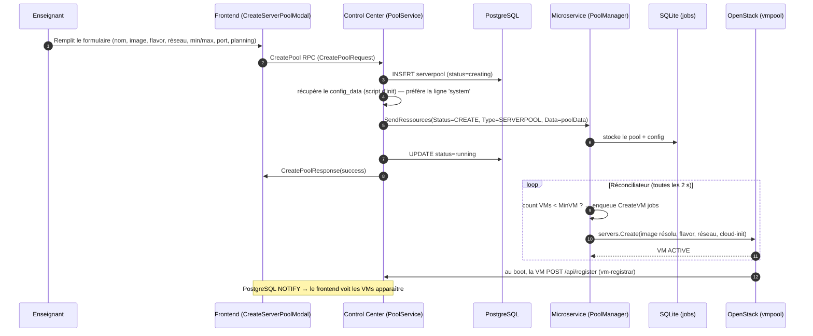
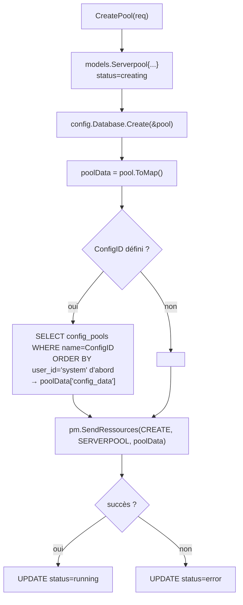
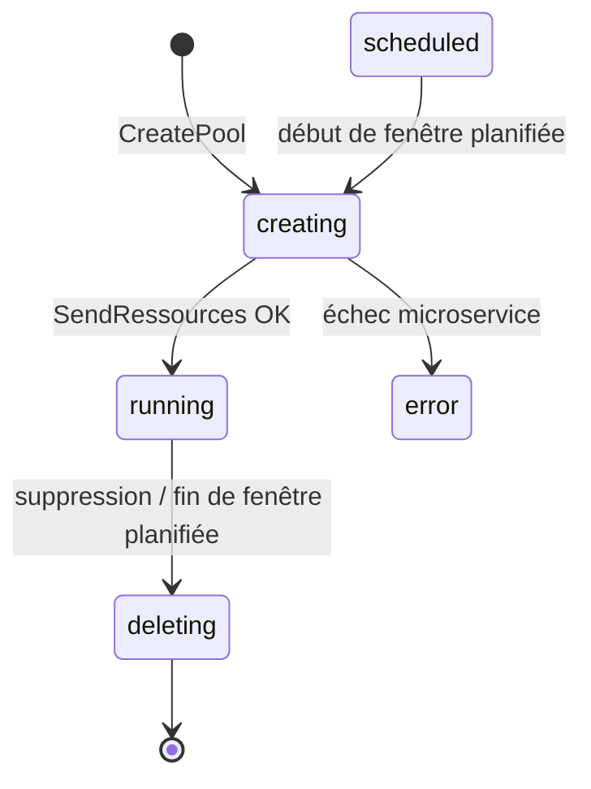

# Création des pools

Un **serverpool** est un groupe de VMs identiques (même image, flavor, réseau) destiné aux
étudiants d'un cours. Sa création part du formulaire frontend et descend jusqu'à OpenStack.

## Vue d'ensemble

## Le formulaire (frontend)

`frontend/src/lib/components/CreateServerPoolModal.svelte` — sections :

1. **Général** — nom, Min/Max VMs, **port application** (optionnel : `0` = aucune app web,
   sinon `8888` pour Jupyter). ⚠️ Mettre **0** pour une VM sans app (Ubuntu) sinon l'étudiant
   verrait un « Démarrage de l'application… » qui tourne dans le vide.
2. **Infrastructure** — Système d'exploitation (famille → version) **ou** environnement Jupyter
   (les images `jupyter-snapshot-*` regroupées sous « JupyterHub », port 8888 auto + config
   d'autostart `jupyter-snapshot-<suffixe>` sélectionnée automatiquement) ; réseau.
3. **Flavor** — liste des flavors avec un statut calculé selon le disque requis par l'image :
   `★ Recommandé` / `ok` / `✗ Disque insuffisant`. Pour les snapshots Jupyter (qui n'exposent
   pas `min_disk`), un défaut de **20 GB** est utilisé (`getImageDiskGb`).
4. **Options avancées** — script d'initialisation, **jours de fermeture** (VMs éteintes ces
   jours, cf. [Provisionnement](04-provisionnement-reconciliation.md#jours-de-fermeture-off-days)),
   **planning** (Jour/Heure/Durée).

La soumission appelle `handleCreateServerpool` (`frontend/src/routes/serverpool/[[id]]/+page.svelte`)
qui construit un `CreatePoolRequest` (user, name, image, flavor, network, min/max, config,
metadata `off_days`, planning, appPort).

## Côté Control Center

`control_center/internal/pool/service.go` → `CreatePool` :

⚠️ **Config dupliquée** : plusieurs lignes peuvent partager un même `name` dans `config_pools`
(une ligne `system` maintenue par le script de snapshot + des copies par utilisateur). La requête
ordonne `user_id='system'` en premier pour **toujours** prendre la version canonique (sinon une
vieille copie périmée — p.ex. avec `start-notebook.sh` et un espace avant `#!/bin/bash` →
`Exec format error` au boot — serait choisie).

`pool.ToMap()` (`control_center/models/serverpool.go`) sérialise notamment `image_ref`,
`flavor_ref`, `min_vm`, `max_vm`, `config_id`, `off_days`, `networks`.

## Côté Microservice

`microservices/openstack/grpc/servergrpc.go` → `handleServerpool` (CREATE) crée un
`models.Serverpool` en SQLite (avec `OffDays = data["off_days"]`) et stocke le `config_data`
dans `config_pools`. Le **réconciliateur** prend ensuite le relais pour créer les VMs (voir
[Provisionnement](04-provisionnement-reconciliation.md)).

## Statuts d'un pool

## Suppression d'un pool

Bouton **Supprimer** → `DeletePool` RPC → le Control Center supprime le pool en base + envoie un
`SendRessources(DELETE)` au microservice, qui supprime les VMs OpenStack et ses lignes locales.
Le réconciliateur ne recrée pas (pool absent des deux bases).
