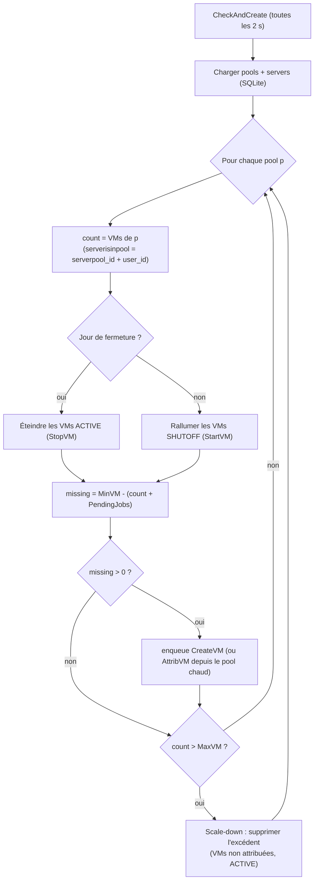
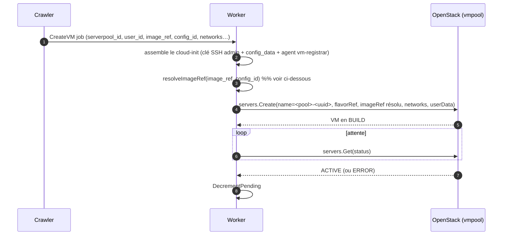
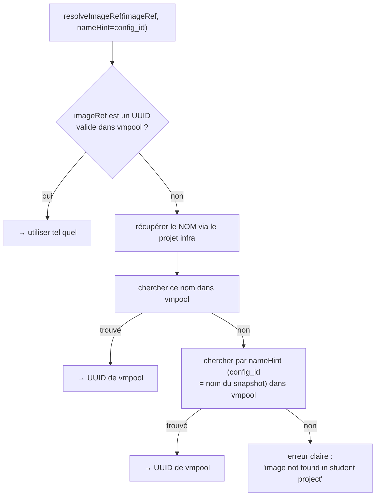

# Provisionnement & réconciliation des VMs

Le **microservice** maintient en continu chaque pool dans l'état désiré. Une boucle
(`Monitor` → `CheckAndCreate`, toutes les **2 s**) compare le nombre de VMs au `MinVM`/`MaxVM`
et agit en conséquence. Fichier central : `microservices/openstack/internal/maincrawler.go`.

## Boucle de réconciliation



### Appartenance à un pool — `serverisinpool`

Une VM appartient au pool si **`serverpool_id` ET `user_id`** correspondent. ⚠️ On **ne compare
PAS** le flavor ni l'image : l'UUID d'image est résolu/peut changer (rebuild de snapshot), donc
comparer l'image empêchait de compter les VMs existantes → le crawler en recréait à l'infini
(runaway). C'est la clé canonique (la même que l'inventaire).

### Compteur `PendingJobs`

À chaque job de création lancé, `IncrementPending(poolID)` ; à la fin (VM ACTIVE ou échec),
`DecrementPending`. `missing = MinVM - (count + PendingJobs)` évite de sur-créer pendant que les
VMs bootent.

## Création d'une VM — `jobs/createVM.go`



### Résolution de l'image ⚠️

Les UUID d'images sont **scopés par projet OpenStack** (cf.
[Architecture](01-architecture.md#les-deux-projets-openstack-️)) et **changent à chaque rebuild**
de snapshot. L'UUID stocké sur le pool peut donc être périmé/invalide côté `vmpool`.
`resolveImageRef(ctx, imageRef, nameHint)` résout vers un UUID **valide dans le projet de
création**, dans l'ordre :



C'est ce filet (notamment via le `config_id` = nom du snapshot) qui rattrape les UUID périmés.

## Démarrage de Jupyter dans la VM (cloud-init) ⚠️

Le `config_data` (script d'init stocké en base) lance un conteneur Docker au boot. Points
appris (importants) :

- Les images de cours sont souvent **repo2docker** : elles **n'ont pas** `start-notebook.sh`
  (réservé aux images `jupyter/docker-stacks`). On lance donc `jupyter lab` **directement**.
- L'installation de nbgrader peut laisser un `packaging` trop ancien pour JupyterLab 4
  (`ImportError: cannot import name 'InvalidName'`) → on fait `pip install -U packaging` au boot.
- Le dossier `/home/jovyan/nbgrader` doit appartenir à l'**UID 1000** (jovyan) sinon nbgrader ne
  peut rien écrire → on `chown -R 1000:1000` côté hôte avant le `docker run`.
- On monte un `nbgrader_config.py` (course_id, root, **exchange inscriptible**).

Script de lancement type (config `jupyter-snapshot-*`) :

```bash
until sudo docker info >/dev/null 2>&1; do sleep 2; done
mkdir -p /home/vmuser/nbgrader/{source,exchange,submitted_copies}
cat > /home/vmuser/nbgrader_config.py <<'NBCFG'
c = get_config()
c.CourseDirectory.course_id = 'jupyter'
c.CourseDirectory.root = '/home/jovyan/nbgrader'
c.Exchange.root = '/home/jovyan/nbgrader/exchange'
NBCFG
chown -R 1000:1000 /home/vmuser/nbgrader /home/vmuser/nbgrader_config.py
sudo docker rm -f jupyter 2>/dev/null || true
sudo docker run -d --restart=always --name jupyter -p 8888:8888 \
  -v /home/vmuser/nbgrader:/home/jovyan/nbgrader \
  -v /home/vmuser/nbgrader_config.py:/home/jovyan/nbgrader_config.py \
  -v /home/vmuser:/home/jovyan/work \
  jupyter-nbgrader:latest \
  bash -lc 'pip install -U packaging >/dev/null 2>&1 || true; exec jupyter lab --ip=0.0.0.0 --port=8888 --ServerApp.token="" --ServerApp.password=""'
```

## Scale-down (anti sur-provisionnement)

Si `count > MaxVM` (et hors pool chaud), le crawler supprime l'excédent — **uniquement** des VMs
**non attribuées** (`Reattrib=false`) et **ACTIVE**, jamais une VM d'étudiant. Un set
`deleteInFlight` (expiration ~90 s) évite de re-enqueuer les mêmes suppressions à chaque tick.

## Jours de fermeture (off-days)

Objectif : **éteindre** (pas supprimer) les VMs les jours cochés (p.ex. le week-end) pour libérer
le calcul, et les rallumer ensuite. L'état/disque est conservé.

```mermaid
flowchart LR
    subgraph "Jour de fermeture"
        A["VMs ACTIVE"] -->|StopVM (servers.Stop)| B["VMs SHUTOFF\n(disque gardé, 0 CPU/RAM)"]
    end
    subgraph "Jour ouvré"
        C["VMs SHUTOFF"] -->|StartVM (servers.Start)| D["VMs ACTIVE"]
    end
```

- `OffDays` = CSV de jours en anglais minuscule (ex. `saturday,sunday`), stocké côté microservice.
- `isOffDay(p)` compare `time.Now().Weekday()` aux `OffDays`.
- Le pool **provisionne toujours** ses machines (jusqu'à MinVM) ; elles sont simplement éteintes
  les jours de fermeture (et rallumées sinon). Un throttle (`powerInFlight`, ~60 s) évite de
  re-enqueuer les stop/start.
- ⚠️ Créer un pool **pendant** son jour de fermeture fait booter les VMs puis les éteint aussitôt
  (léger gâchis) ; en usage normal (créer en semaine), pas de va-et-vient.

Jobs concernés : `models.StopVM` / `models.StartVM` → `jobs/powerVM.go` (`servers.Stop` /
`servers.Start`), dispatchés par `internal/worker/workers.go`.

## Synchronisation vers le Control Center

`Sync_DB` (toutes les 5 s) lit les VMs OpenStack → met à jour les `Server` SQLite → déclenche le
stream gRPC `GetStreamRessources` → le Control Center fait un UPSERT en PostgreSQL
(`client_openstack.go`). C'est ce qui alimente l'inventaire et l'attribution.
