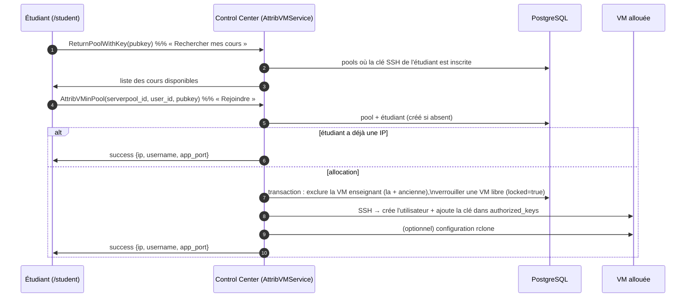
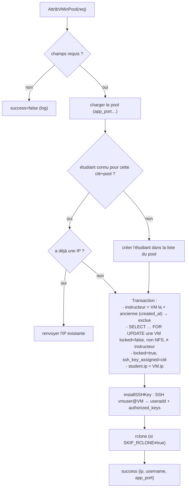
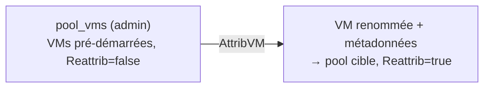

# Attribution d'une VM à un étudiant

Quand un étudiant « Rejoint » un cours, le système lui alloue une VM du pool et y injecte sa clé
SSH publique (récupérée via GitHub).

## Parcours étudiant

Code : `control_center/internal/attribvm/service.go`.

## Détails de l'allocation (`AttribVMinPool`)

**Points importants :**
- La **VM enseignant** = la plus ancienne du pool (`ORDER BY created_at ASC`) ; elle est **exclue**
  de l'attribution étudiante. ⚠️ Le champ `created_at` doit exister sur `servers` (ajouté au
  modèle `control_center/models.Server`) sinon la requête échoue et **abortait la transaction
  PostgreSQL** (`SQLSTATE 25P02`), faisant échouer toute l'attribution.
- Conséquence : un pool de **1 seule VM** → cette VM est l'enseignant → **« no available server »**.
  Il faut **≥ 2 VMs** (1 enseignant + ≥ 1 étudiant).
- `installSSHKey` (`service.go`) crée un compte Linux par étudiant (nom dérivé de l'email/login)
  et ajoute sa clé publique dans `~/.ssh/authorized_keys`.

## Erreurs « lisibles » ⚠️

Les échecs métier renvoient **`success=false` + erreur gRPC nil** (pas une erreur gRPC), avec la
vraie raison **loggée côté serveur** (`[attribvm] …`). Pourquoi : une erreur gRPC produit une
réponse « trailers-only » que le module `grpc_web` de Caddy ré-encode mal (`grpc-status:0` dans le
corps), que le front affiche en faux **`[unimplemented] missing message`**. En renvoyant toujours
un message, le front affiche « Aucune VM disponible ou erreur backend » et la vraie cause est dans
les logs.

## Pool chaud (warm pool) — attribution rapide

Un pool spécial `pool_vms` (user `admin`) garde des VMs pré-démarrées. `AttribVM`
(`jobs/attribVM.go`) prend une VM libre du pool chaud (`Reattrib=false`), bascule son `Reattrib`,
la **renomme** `<serverpool_id>-<uuid>` et change ses métadonnées `user_id`/`serverpool_id` vers
le pool cible — la VM « migre » sans recréation. Le crawler déclenche `AttribVM` plutôt que
`CreateVM` quand les conditions du pool chaud sont réunies (`maincrawler.go`).

Le pool chaud n'est **jamais** scale-down ni mis en off-day (sinon l'attribution serait privée de
réserve).

## Côté inventaire / suivi

L'enseignant suit en temps réel via **Inventaire** / **Mes étudiants** : statut des VMs, santé,
**activité** (badge « Sur Jupyter » si quelqu'un est connecté — sondage de `/api/status` Jupyter),
bouton **Terminal** (Guacamole). Voir [Accès aux VMs](06-acces-vm.md).
