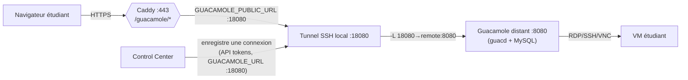

# Accès aux VMs

Une fois une VM attribuée, l'étudiant (et l'enseignant via l'inventaire) peut y accéder de
plusieurs façons selon le type d'image.

| Accès | Pour quel type de VM | Mécanisme |
|-------|----------------------|-----------|
| **JupyterLab** | images Jupyter (port app = 8888) | lien direct `http://<ip>:8888/lab` (nouvel onglet) |
| **Terminal web** | toute VM (surtout Ubuntu, port app = 0) | **Guacamole** (proxifié, HTTPS) |
| **SSH** | toute VM | `ssh <username>@<ip>` avec la clé de l'étudiant |

## Affichage adaptatif côté étudiant

La page `/student` adapte l'affichage selon `app_port` (`frontend/src/routes/student/+page.svelte`) :

```mermaid
flowchart TB
    A["VM attribuée"] --> Q{"app_port > 0 ?"}
    Q -->|oui (Jupyter)| J["« Démarrage de l'application… »\npuis « Ouvrir JupyterLab » + « Soumettre mes travaux »"]
    Q -->|non (Ubuntu…)| G["« Ouvrir le terminal web (Guacamole) »\n(ou « Préparation de l'accès… » en attendant)"]
    J --> S["+ Connexion SSH (commande à copier)"]
    G --> S
```

- Le frontend sonde `/api/app-status?ip=…&port=…` pour savoir quand l'app (Jupyter) est prête.
- ⚠️ Pour une VM **sans app**, mettre **port = 0** à la création, sinon l'étudiant voit un
  « Démarrage de l'application… » qui ne finit jamais (aucune app sur ce port).

## Guacamole (terminal web)

Guacamole permet un accès **clientless** (dans le navigateur, sans client SSH) à la VM. Dans ce
déploiement, Guacamole tourne sur un **hôte distant** ; un **tunnel SSH** l'expose localement.



### Comment le bouton « Terminal » apparaît

1. Le Control Center initialise un client Guacamole au démarrage (`guacamole.NewClientFromEnv`,
   variables `GUACAMOLE_URL`, `GUACAMOLE_PUBLIC_URL`, `GUACAMOLE_ADMIN_USER/PASS`,
   `GUACAMOLE_SSH_USER`).
2. La boucle de monitoring (`guacamoleSyncLoop`) **enregistre** chaque VM `ready` sans connexion
   dans Guacamole → reçoit un `guac_connection_id` stocké sur la `vm_instance`.
3. L'inventaire / la page étudiant exposent `guac_url` = `BuildClientURL(guac_connection_id)`
   (basée sur `GUACAMOLE_PUBLIC_URL`) → le bouton **Terminal** / « Ouvrir le terminal web ».

Endpoints : `GET /api/guac-url?ip=…` et la construction d'URL dans
`control_center/grpc/inventory.go` + `internal/guacamole/client.go`.

### Pièges connus ⚠️

- **Le tunnel doit tourner** : sans lui, rien n'écoute sur `:18080` → le Control Center logge
  `dial tcp …:18080: connection refused` → pas de `guac_connection_id` → **pas de bouton**.
  Démarrage : `./dev.sh start guac` (cf. [Développement](09-developpement-exploitation.md)).
- **Cohérence du port** : `control_center/.env` doit pointer `GUACAMOLE_URL=http://127.0.0.1:18080/…`
  **et** définir `GUACAMOLE_PUBLIC_URL=http://<IP>:18080/…`. Un `:8080` périmé = échec.
- Les `guac_connection_id` sont propres à l'instance Guacamole ; après changement d'instance, les
  VMs sont ré-enregistrées automatiquement par la boucle de sync.

## SSH direct

La page étudiant affiche la commande `ssh <username>@<ip>` (et, si besoin de mot de passe, la
variante `ssh -i ~/.ssh/id_ed25519 …`). Le compte et la clé ont été créés lors de l'attribution
(cf. [Attribution](05-attribution-etudiants.md)).

## Détection d'activité (inventaire)

Le badge **« Sur Jupyter »** (colonne *Activité*) est calculé en sondant l'API Jupyter de la VM :
`GET http://<ip>:8888/api/status` → si `connections > 0` ou `kernels > 0`, la VM est marquée
**active** (`probeAppPort` dans `inventory.go`). C'est ce qui alimente aussi le compteur
« N étudiants connectés » sur la carte « Mes cours ».
