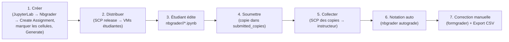
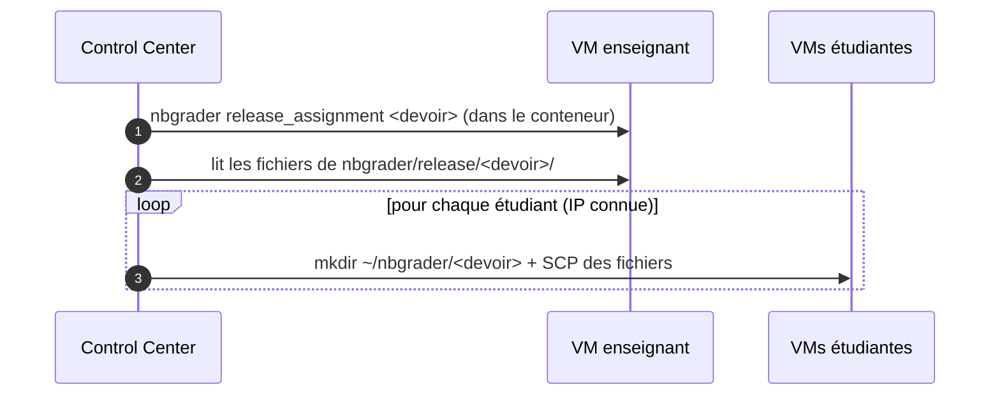
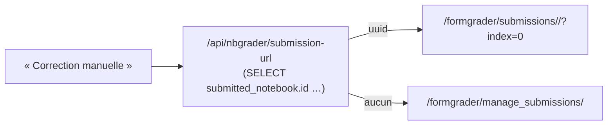

# Notation nbgrader

Le module **Notation** permet à un enseignant de créer des devoirs Jupyter, les distribuer aux
étudiants, collecter les copies, les noter automatiquement et corriger manuellement (formgrader).

⚠️ Le système **n'utilise pas l'exchange nbgrader** : la distribution et la collecte se font par
**SCP** directement entre la VM enseignant et les VMs étudiantes (orchestré par le Control Center).

## Cycle de vie d'un devoir

## La page Notation (frontend)

`frontend/src/routes/grading/+page.svelte` :
- Sélecteur de **pool** + d'**assignment** (liste = dossiers de `nbgrader/source/`).
- **Actions** : Distribuer / Collecter / Notation automatique / Exporter CSV (avec confirmation
  puis **bannière verte** de succès).
- **Tableau de bord** (panneau droite) : boutons « Ouvrir JupyterLab » / « Ouvrir Formgrader »
  (nouvel onglet), + stats (copies notées, moyenne, à corriger) et **distribution des notes**,
  ou un guide si aucun assignment noté.
- Tableau des **notes** par étudiant + bouton **Correction manuelle**.

## Endpoints backend (Control Center)

Tous dans `control_center/grpc/nbgrader.go`, exposés en REST `/api/nbgrader/*`. Ils se connectent
en **SSH** à la VM enseignant (`nbgraderSSHClient`) et exécutent nbgrader dans le conteneur Docker
(`dockerExec`).

| Endpoint | Action |
|----------|--------|
| `GET /assignments` | liste les dossiers de `nbgrader/source/` (les vrais devoirs) |
| `POST /release` | `nbgrader release_assignment` + SCP des fichiers vers chaque VM étudiante |
| `POST /collect` | récupère par SCP les copies des étudiants → `submitted/<student>/<devoir>/` |
| `POST /autograde` | `nbgrader autograde <devoir>` |
| `GET /grades` | export CSV / lecture du gradebook (notes par étudiant) |
| `GET /export-csv` | export CSV téléchargeable |
| `POST /submit` | (étudiant) copie son travail dans `submitted_copies` |
| `GET /jupyter-url` | URL JupyterLab + URL proxy de la VM enseignant |
| `GET /submission-url` | URL formgrader directe pour corriger une copie |

### Distribution (release)

### Soumission & collecte

- L'étudiant clique **Soumettre** → `/submit` copie `~/nbgrader/<devoir>` →
  `~/nbgrader/submitted_copies/<devoir>` puis `chmod -R a-w` (lecture seule).
  ⚠️ On utilise `a-w` et **pas** `444` : `444` retire le bit d'exécution des **dossiers** → ils
  deviennent non traversables → la collecte trouve 0 copie.
- **Collecter** lit `submitted_copies/<devoir>` (ou `<devoir>`) par SCP et reconstruit
  `submitted/<student>/<devoir>/` côté enseignant + `nbgrader db student add`.

## Correction manuelle (formgrader)

Le bouton **Correction manuelle** ouvre la page formgrader de la copie. ⚠️ La route correcte est
`/formgrader/submissions/<submitted_notebook_id>/?index=0` — l'identifiant est celui du **notebook
soumis** (`submitted_notebook.id`), **pas** celui de l'assignment soumis. L'endpoint
`/api/nbgrader/submission-url` résout cet UUID dans le gradebook ; à défaut, on retombe sur la
liste `/formgrader/manage_submissions/<devoir>`.

## Prérequis image ⚠️

Pour que la notation/formgrader marche, l'image doit avoir **nbgrader ≥ 0.9.5** :
- une image avec un vieux nbgrader (p.ex. **0.7.0.dev0** préinstallé) plante l'API formgrader
  (`AttributeError: 'CompoundSelect' object has no attribute 'mapper'`, conflit SQLAlchemy) ;
- d'où `pip install -U nbgrader` dans le Dockerfile des snapshots
  (cf. [Snapshots & images](08-snapshots-images.md)).
- Le dossier `nbgrader` doit être inscriptible par `jovyan` (UID 1000) sinon création
  d'assignment / gradebook impossible (cf.
  [Provisionnement](04-provisionnement-reconciliation.md#démarrage-de-jupyter-dans-la-vm-cloud-init-️)).

## Notebook d'exemple

`example/assignment-demo.ipynb` — un devoir nbgrader complet (cellules auto-notées + tests cachés
+ une question à correction manuelle, schema_version 3) pour tester le cycle complet sur une image
nbgrader 0.9.5.
