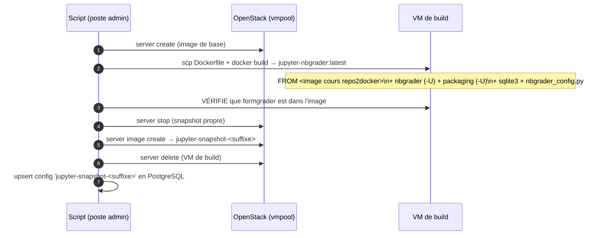
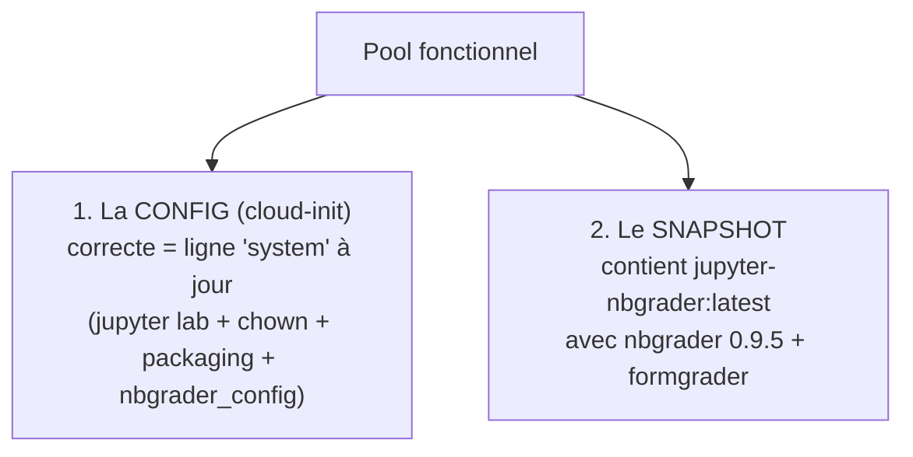

# Snapshots & images

Les environnements Jupyter sont fournis sous forme de **snapshots OpenStack** (`jupyter-snapshot-*`)
qui contiennent une image Docker **enrichie nbgrader** pré-construite. Ils sont fabriqués par des
scripts dans `scripts/`.

## Scripts

| Script | Rôle |
|--------|------|
| `scripts/make-jupyter-snapshots.sh` | construit un snapshot par environnement (boucle ENVS) |
| `scripts/snapshot-worker.sh` | variante worker (build alternatif) |
| `scripts/run-all-snapshots.sh` | lance tous les snapshots |
| `scripts/make-nbgrader-snapshot.sh` | image enseignant nbgrader |

## Principe de construction



## Le Dockerfile (couche nbgrader)

Construit **par-dessus l'image de cours** (souvent repo2docker). Points appris ⚠️ :

```dockerfile
FROM ${base_image}
USER root
RUN apt-get install -y sqlite3            # gradebook nbgrader
RUN pip install -U nbgrader               # ⚠️ -U sinon un vieux nbgrader préinstallé reste
RUN pip install -U packaging              # ⚠️ JupyterLab 4 exige un packaging récent
RUN jupyter ... enable nbgrader (nbextension + server extension)
RUN echo "course_id='jupyter' ; root=/home/jovyan/nbgrader" > nbgrader_config.py
USER jovyan
```

- **`pip install -U nbgrader`** : sans `-U`, si l'image de base embarque déjà un vieux nbgrader
  (ex. `0.7.0.dev0`), `pip install nbgrader` est un **no-op** → formgrader plante
  (`'CompoundSelect' object has no attribute 'mapper'`). compeco (0.9.5) marche ; testFinal
  (0.7) plantait.
- **`pip install -U packaging`** : nbgrader peut laisser `packaging 23.1`, trop vieux pour
  JupyterLab 4 → `ImportError: cannot import name 'InvalidName' from 'packaging.utils'`.

## Garde-fou avant snapshot

Le script **vérifie** que `jupyter server extension list` contient `formgrader` **avant** de
prendre le snapshot. Si non → suppression de la VM de build + arrêt bruyant (plus de fallback
silencieux qui taguait une image **sans** nbgrader comme `jupyter-nbgrader:latest`). Cela évite
de produire des snapshots cassés.

## Deux variables indépendantes pour un pool fonctionnel ⚠️



Beaucoup de pannes venaient de l'une **ou** l'autre :
- **config** : ancien `start-notebook.sh`, espace avant `#!/bin/bash` (→ `Exec format error`),
  doublon `admin@…` choisi à la place de `system`, dossier root-owned… → corrigés (cf.
  [Création des pools](03-creation-pools.md) et [Provisionnement](04-provisionnement-reconciliation.md)).
- **snapshot** : `eco589` n'avait **aucune** image Docker baked ; d'autres avaient l'image de
  cours brute (sans nbgrader). → garde-fou ci-dessus + `pip -U nbgrader`.

## Reconstruire un snapshot

Le script **saute** un snapshot existant. Pour le reconstruire :

```bash
openstack --os-cloud ipp-idcs-vmpool image delete jupyter-snapshot-<nom>
./scripts/make-jupyter-snapshots.sh <nom>
```

Si le build échoue, le script s'arrête avec un message clair (souvent : la VM de build n'atteint
pas le registry pour puller l'image de cours).

## Images vs config — où c'est stocké

- **Images** : Glance OpenStack (projet `vmpool`), nommées `jupyter-snapshot-<suffixe>`.
- **Config d'autostart** : table `config_pools` (nom `jupyter-snapshot-<suffixe>`, idéalement
  `user_id='system'`).
- ⚠️ Le **listing** des images au frontend vient du projet **infra** (`vmpoolmanager`) ; les UUID
  diffèrent du projet `vmpool` — d'où la résolution d'image à la création
  ([Provisionnement](04-provisionnement-reconciliation.md#résolution-de-limage)).
