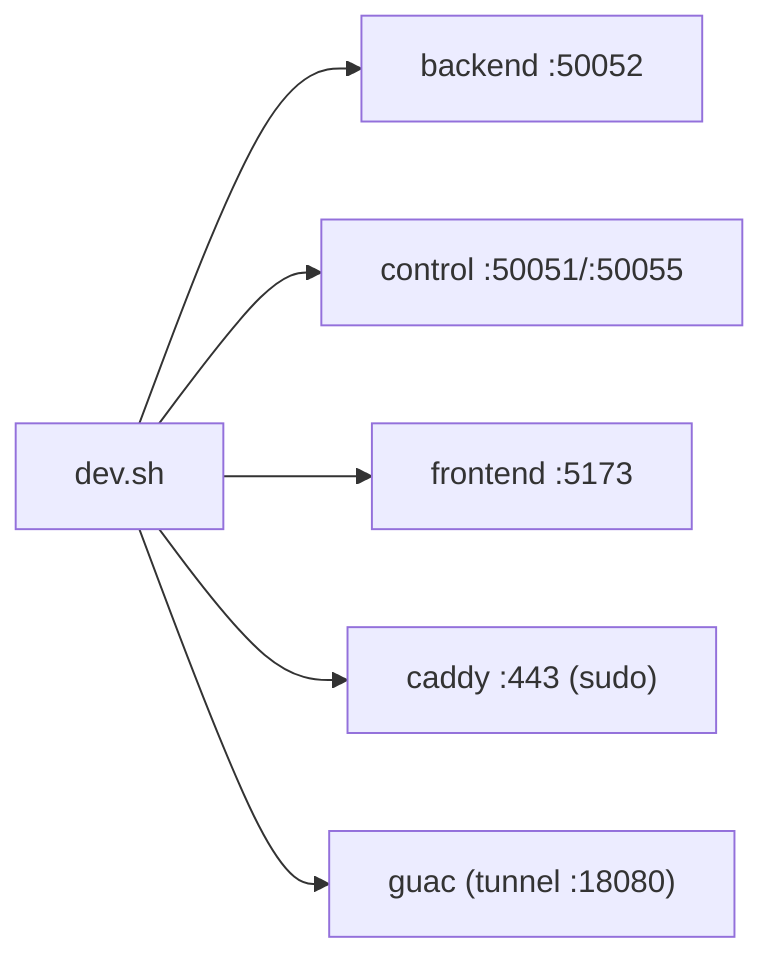
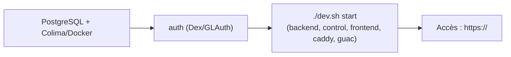

# Développement & exploitation

Comment lancer la stack en local, la configuration, et le dépannage des pannes déjà rencontrées.

## Lancer tous les services — `dev.sh`

`dev.sh` (racine) pilote tous les services en arrière-plan, **sans tmux** :

```bash
./dev.sh start            # tout démarrer (demande sudo 1× pour Caddy/443)
./dev.sh stop             # tout arrêter
./dev.sh restart          # tout redémarrer
./dev.sh restart control  # redémarrer UN service
./dev.sh status           # état (● up / ○ down)
./dev.sh logs backend     # suivre les logs d'un service (Ctrl-C pour sortir)
```

Services gérés : `backend` (microservice), `control` (control center), `frontend` (Vite),
`caddy` (reverse proxy 443, sudo), `guac` (tunnel SSH Guacamole 18080), + `auth` (Dex/GLAuth docker).
Logs dans `.devlogs/`.



Alternative historique : le `Taskfile.yaml` (`task dev`, `task control`, `task backend`,
`task frontend`, `task caddy`, `task guac`, `task auth`).

## Configuration (.env)

Copier `.env.example` → `.env`. Variables clés :

| Variable | Rôle |
|----------|------|
| `POSTGRES_*` | connexion PostgreSQL centrale |
| `OS_CLOUD` | projet OpenStack de **création** des VMs (`ipp-idcs-vmpool`) |
| `INFRA_OS_CLOUD` | projet OpenStack de **listing** images/flavors/réseaux (`ipp-idcs-vmpoolmanager`) |
| `SSH_PUBLIC/PRIVATE_KEY_PATH` | clés SSH d'accès admin aux VMs |
| `REGISTRAR_CONTROL_CENTER_URL` | URL que les VMs appellent au boot (`/api/register`) |
| `GUACAMOLE_URL` | API Guacamole vue par le control center (`http://127.0.0.1:18080/guacamole`) |
| `GUACAMOLE_PUBLIC_URL` | URL Guacamole vue par le **navigateur** (`http://<IP>:18080/guacamole`) |
| `GITHUB_CLIENT_ID/SECRET/REDIRECT_URL` | OAuth GitHub étudiant |

Identifiants OpenStack : `clouds.yaml` (depuis `clouds.yaml.template`).
Configs auth (`auth/dex.yaml`, `auth/glauth.cfg`) : **gitignored**, ne jamais committer.

### Les deux `.env` ⚠️

Le Control Center charge **`control_center/.env`** en priorité (`godotenv.Load()`), puis
`../.env` en repli (`control_center/main.go`). Le microservice utilise la racine `.env`
(`DOTENV_PATH`). **Garder les deux cohérents** — un `GUACAMOLE_URL` périmé (`:8080` au lieu de
`:18080`) dans `control_center/.env` a déjà cassé Guacamole.

## Bases de données

| BDD | Service | Notes |
|-----|---------|-------|
| PostgreSQL | Control Center | AutoMigrate au démarrage (`config/database.go`) |
| SQLite `PoolManagerVM.db` | Microservice | AutoMigrate au démarrage ; file de jobs + miroir pools/servers |

## Dépannage — symptômes déjà rencontrés

| Symptôme | Cause | Correctif |
|----------|-------|-----------|
| Pool absent de l'inventaire, 0 VM | `400 Can not find requested image` (UUID périmé/inter-projets) | `resolveImageRef` (via `config_id`) |
| Sur-provisionnement (3 → 13 VMs) | `serverisinpool` comparait l'image | match sur `serverpool_id`+`user_id` ; scale-down > MaxVM |
| « Démarrage de l'application… » infini (Ubuntu) | port app forcé ≥ 1 sur une VM sans app | port optionnel (`0` = aucun) |
| Conteneur jupyter en crash-loop | `start-notebook.sh` absent (repo2docker) / `packaging` trop vieux | `jupyter lab` + `pip -U packaging` |
| Formgrader 404 / création d'assignment KO | dossier `nbgrader` root-owned | `chown -R 1000:1000` + `nbgrader_config` monté |
| `[unimplemented] missing message` au join | erreur gRPC « trailers-only » mal ré-encodée par Caddy | renvoyer `success=false` + message |
| Crash formgrader (`CompoundSelect … mapper`) | vieux nbgrader (0.7) | `pip install -U nbgrader` dans le snapshot |
| Pas de bouton Terminal / Guacamole | tunnel `:18080` éteint ou `.env` périmé | `./dev.sh start guac` + `GUACAMOLE_URL/PUBLIC_URL` :18080 |
| Login GitHub nécessite plusieurs clics | routeur SPA SvelteKit intercepte | `data-sveltekit-reload` sur le lien |
| `Exec format error` cloud-init | espace avant `#!/bin/bash` dans une config dupliquée | réécrire les configs + préférer `user_id='system'` |
| Off-days sans effet | `OffDays` stocké mais jamais relu | enforcement dans le crawler (stop/start) |

## Démarrage à froid (ordre conseillé)



⚠️ Caddy n'écoute que sur `:443` ; il faut sudo. Le check `lsof -i :443` de `task caddy` peut
afficher un faux échec (lsof sans sudo ne voit pas le socket root) alors que Caddy tourne —
`dev.sh status` teste la connexion TCP et est fiable.
