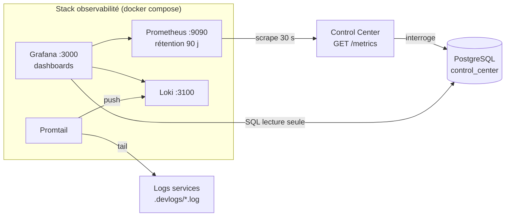
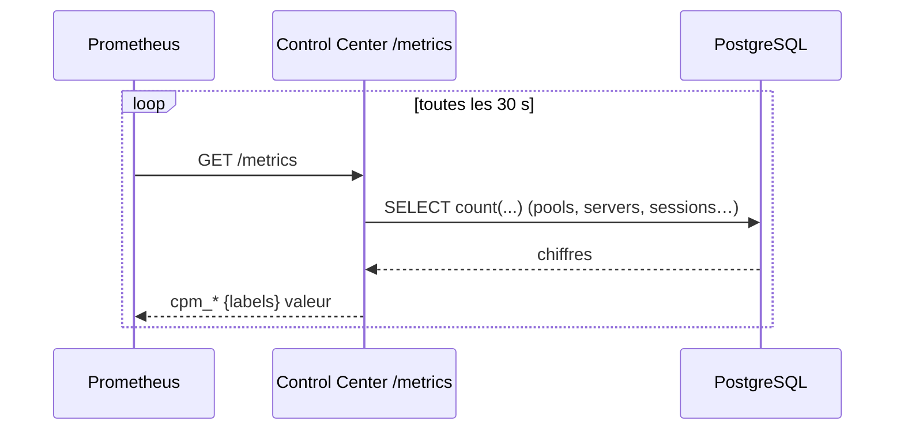
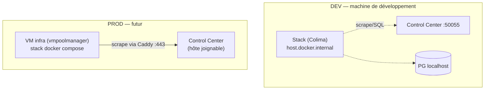

# Observabilité — métriques, logs, usage

Stack de supervision pour suivre l'**usage** de la plateforme (heures de pointe, nombre de VMs
actives, connexions, occupation des pools) et **centraliser les logs** des services. Trois
briques open-source :

| Brique | Rôle | Port |
|--------|------|------|
| **Prometheus** | Collecte et historise les **métriques** (séries temporelles) | 9090 |
| **Loki** | Stocke et indexe les **logs** | 3100 |
| **Grafana** | **Visualisation** (dashboards) + requêtes ad-hoc PostgreSQL | 3000 |
| **Promtail** | Agent qui **pousse les logs** des services vers Loki | — |

Tout est défini dans `monitoring/` (déploiement : `monitoring/README.md`).

## Vue d'ensemble



## 1. Les métriques exposées par le Control Center

Le Control Center expose un endpoint **`GET /metrics`** (port `50055`, format Prometheus). Un
*collector* custom (`control_center/grpc/metrics.go`) interroge PostgreSQL **à chaque scrape**
et publie :

| Métrique | Type | Signification |
|----------|------|---------------|
| `cpm_pools_total` | gauge | Nombre de serverpools |
| `cpm_servers{status}` | gauge | VMs par statut (`ACTIVE`, `SHUTOFF`, `BUILD`…) |
| `cpm_vms_active` | gauge | VMs avec un utilisateur connecté |
| `cpm_students_total` | gauge | Étudiants enregistrés |
| `cpm_github_sessions_24h` | gauge | Connexions GitHub sur 24 h glissantes |
| `cpm_pool_students{pool,owner}` | gauge | Étudiants par pool |
| `cpm_batch_jobs{status}` | gauge | Jobs batch par statut |
| `cpm_vm_instances_total` | gauge | VMs enregistrées (registrar) |
| `cpm_vm_registrar_stale` | gauge | VMs sans heartbeat depuis > 30 min |
| `cpm_month_cost` | gauge | Coût estimé cumulé du mois (devise configurée) |
| `cpm_month_vm_hours` | gauge | Heures-VM cumulées du mois |
| `cpm_pool_month_cost{pool,owner}` | gauge | Coût du mois par pool |
| `cpm_storage_allocated_gb` / `cpm_storage_quota_gb` | gauge | Stockage alloué vs quota |

> Le collector lit la base à la volée : pas de cache, pas de tâche de fond. Prometheus
> historise ensuite ces valeurs (1 point / 30 s) → on obtient les **courbes dans le temps**
> (ex. pic de VMs actives en milieu de TP).



### Métriques d'événement (compteurs / histogrammes)

En plus des gauges d'état, des **compteurs** mesurent les événements métier
(`control_center/internal/metrics`, exposés sur le même `/metrics`) :

| Métrique | Type | Signification |
|----------|------|---------------|
| `cpm_vm_attribution_total{result}` | counter | Attributions de VM (success/fail) |
| `cpm_proxy_sessions_total{kind}` | counter | Ouvertures de session proxy (jupyter/vscode) |
| `cpm_batch_jobs_processed_total{result}` | counter | Jobs batch terminés |
| `cpm_batch_job_duration_seconds` | histogram | Durée des jobs batch |
| `cpm_vm_action_total{action,result}` | counter | Actions start/stop/… |

### Microservice OpenStack — `/metrics` dédié

Le microservice expose désormais son propre endpoint Prometheus (port `METRICS_PORT`, défaut
`:50053` — `microservices/openstack/internal/metrics`) :

| Métrique | Type | Signification |
|----------|------|---------------|
| `cpm_vm_provision_total{result}` | counter | Provisionnements de VM (success/failed) |
| `cpm_vm_provision_duration_seconds` | histogram | Durée création → ACTIVE |
| `cpm_openstack_errors_total{operation}` | counter | Erreurs API OpenStack (create/get/image…) |

> **OTel complémentaire.** Les deux services sont aussi instrumentés OpenTelemetry (traces →
> Tempo, logs → Loki), activable via `OTEL_EXPORTER_OTLP_ENDPOINT` (désactivé par défaut). Les
> métriques Prometheus ci-dessus fonctionnent **indépendamment** d'OTel.

### Routage & accès (⚠️ scrape INTERNE)

`/metrics` est servi par le mux REST (hors gRPC-Web). Depuis l'audit Acunetix, il est
**bloqué (404) côté Caddy public** (une fuite de métriques Prometheus était signalée).
Prometheus scrape donc les endpoints **internes**, jamais via le domaine :

- Control Center : `<ip-interne>:50055/metrics`
- Microservice OpenStack : `<ip-interne>:50053/metrics`

Ces ports ne doivent être ouverts qu'au **réseau interne** (security group).

## 2. Les logs (Loki + Promtail)

Promtail tourne sur la machine qui héberge les services, lit `.devlogs/*.log`
(`backend.log`, `control.log`, `caddy.log`, `frontend.log`, `guac.log`) et les pousse vers
Loki avec le label `job="cloudpoolmanager"`. Dans Grafana → **Explore** → datasource **Loki** :

```logql
{job="cloudpoolmanager"} |= "error"
{job="cloudpoolmanager", filename="/logs/backend.log"}
```

## 3. Données métier (datasource PostgreSQL)

Grafana dispose d'une datasource **PostgreSQL en lecture seule** (`grafana_ro`) pour les
requêtes SQL directes que les métriques ne couvrent pas (détail par étudiant, historique
d'attribution…). En prod, créer l'utilisateur avec `monitoring/grafana_ro_user.sql`.

## 4. Dashboards fournis

Trois dashboards provisionnés automatiquement (`monitoring/grafana/provisioning/dashboards/`) :

- **CloudPoolManager — Usage** (`cpm-usage.json`) : pools, VMs actives, étudiants, connexions
  GitHub, VMs par statut, étudiants par pool, logs.
- **CloudPoolManager — Santé plateforme** (`cpm-platform-health.json`) : services up/down,
  provisioning (taux + durée p50/p90), erreurs OpenStack, attribution, jobs, sessions proxy,
  CPU/mémoire/disque hôte.
- **CloudPoolManager — Coûts & comptabilité** (`cpm-costs.json`) : coût du mois, heures-VM,
  coût par pool, stockage vs quota, et une **table de comptabilité par utilisateur** (SQL sur
  `vm_usage`). Voir [Waldur](14-waldur.md) pour l'accounting cible.

## 4bis. Alerting — Alertmanager + e-mail SMTP

Les alertes sont déclenchées par Prometheus (`monitoring/prometheus/rules/alerts.rules.yml`)
et routées par **Alertmanager** (`:9093`) vers l'**e-mail** :

- **Règles** : services down (Control Center / microservice), échecs & lenteur de provisioning,
  erreurs API OpenStack, VMs en ERROR / sans heartbeat, échecs d'attribution & de jobs,
  dépassement de quota de stockage, coût mensuel élevé, disque/mémoire/charge de l'hôte.
- **SMTP** : à renseigner dans `monitoring/alertmanager/alertmanager.yml` (`smtp_*`) + les
  adresses `to:` (receivers `email-default` et `email-critical`). Destinataires à définir.
- **Exporters infra** : `node-exporter` (hôte) + `cAdvisor` (conteneurs) ajoutés à la stack.
- **Validation** avant déploiement : `promtool check config/rules`, `amtool check-config`
  (voir `monitoring/README.md`).

## 5. Topologie de déploiement



> **Contrainte réseau (constatée).** Une VM du projet OpenStack `vmpoolmanager` **ne route pas**
> la machine de dev (NAT/VPN) ni l'hôte PostgreSQL — scrape et SQL en timeout. La stack doit
> donc tourner **là où elle atteint le Control Center et PG** : sur la machine de dev en
> développement, sur une VM infra seulement quand le Control Center prod est joignable depuis
> ce projet. Détails et commandes : `monitoring/README.md`.

## 6. Sécurité

- **`/metrics` jamais public** : bloqué au niveau Caddy (404) ; scrape uniquement en interne
  (`:50055` control center, `:50053` microservice). Ces ports + ceux de la stack
  (`9090/9093/9100/8080/3000`) ne doivent **pas** être exposés sur Internet (security group).
- Datasource PostgreSQL **SELECT-only** (`grafana_ro`) ; le dashboard de coûts utilise du SQL
  **statique** (aucune entrée utilisateur → pas d'injection).
- Secrets (mots de passe Grafana/PG) dans `monitoring/.env` — **gitignoré**. ⚠️ Les identifiants
  **SMTP** d'Alertmanager sont dans `monitoring/alertmanager/alertmanager.yml` (fichier de config,
  non gitignoré) : n'y mettre de vrais identifiants qu'au déploiement, idéalement via un fichier
  d'override gitignoré (cf. [Sécurité](13-securite.md)).
- Certaines métriques portent des **e-mails de propriétaires** en labels
  (`cpm_pool_month_cost`, `cpm_pool_students`) → raison de plus pour garder `/metrics` interne.
- `cAdvisor` tourne en `privileged` et `node-exporter` monte `/` en lecture seule : à ne rendre
  accessibles qu'au réseau interne.
- Changer `GF_ADMIN_PASSWORD` ; idéalement Grafana derrière un proxy authentifié.
