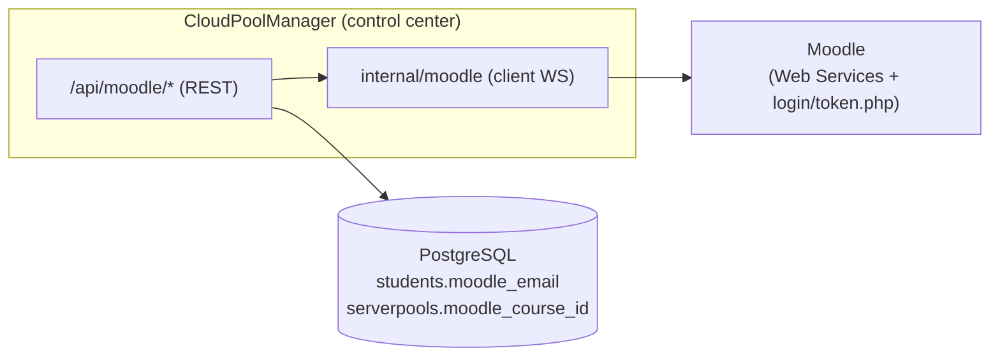

# Intégration Moodle

Brancher Moodle comme source de vérité pédagogique : import des élèves, connexion via Moodle,
et remontée des notes nbgrader. Repose sur les **Web Services REST** de Moodle (un token) et sur
`login/token.php` pour l'authentification. Conçu pour basculer vers le Moodle de l'école en
changeant juste `MOODLE_URL` + `MOODLE_TOKEN`.

> **Clé d'identité = l'email.** Lien entre : compte Moodle ↔ ligne `students` ↔ identifiant
> nbgrader ↔ utilisateur Moodle pour le push des notes.

## Vue d'ensemble



## Moodle local de développement

`moodle/` contient un Moodle complet (Docker). Voir `moodle/README.md`.
```bash
cd moodle && cp .env.example .env && docker compose up -d
cd .. && scripts/moodle-bootstrap.sh        # WS + token + cours/élèves/devoirs + perms
```
UI : http://localhost:8081. Le bootstrap écrit `MOODLE_URL`/`MOODLE_TOKEN` dans `.env` (racine
et `control_center/.env`, gitignorés).

## 1. Import des élèves (Phase 2)

Un pool → **Étudiants → onglet « Moodle »** → choisir un cours → importer.
- `GET /api/moodle/courses`, `GET /api/moodle/enrolments?course_id=`
- `POST /api/moodle/import` crée une ligne `students` par élève (`Name=email`, `MoodleEmail`,
  `MoodleUserID`), **sans clé SSH**, et mémorise `serverpools.moodle_course_id`. Idempotent.

## 2. Connexion via Moodle (Phase 3)

Portail étudiant → **« Se connecter avec Moodle »** (identifiant/mot de passe).
- `POST /api/moodle/login` valide via `login/token.php`, récupère l'email via le token de service,
  crée une session légère (`moodle_sessions`). Flux **étudiant** (les profs/admins utilisent OIDC).
- `GET /api/moodle/my-pools?email=` → cours de l'élève. `POST /api/moodle/attrib-vm` attribue une
  VM **sans clé SSH** (`AttribVMByEmail`) : accès **JupyterLab** (navigateur) + **Guacamole**
  (clé gérée côté plateforme). Même exclusion de la VM instructeur que le flux par clé.

## 3. Remontée des notes (Phase 4)

Page **Notation** → après notation, choisir le devoir Moodle cible → **« Envoyer les notes vers
Moodle »**. Lien direct vers le **carnet de notes** du cours.
- `GET /api/moodle/assignments?pool_id=&user_id=` (résout le cours via le pool).
- `POST /api/moodle/push-grades` lit les notes nbgrader (`fetchNbgraderGrades`), mappe
  `email → moodle_user_id`, met à l'échelle `score/max_score × barème`, et appelle
  `mod_assign_save_grade` par élève. Cible = une activité **devoir (mod_assign)** Moodle.
- Lien **« Moodle ↗ »** dans la barre de navigation (admin).

## Notes techniques / pièges

- Images **`bitnamilegacy/`** (Bitnami a déplacé les tags versionnés en 2025).
- `core_course_get_courses` échoue sur un verrou de cache → on utilise
  `core_course_get_courses_by_field`.
- `login/token.php` exige le **service mobile activé** ; l'email s'obtient via le **token de
  service** (le token utilisateur n'a pas accès à `core_user_get_users_by_field`).
- `mod_assign_get_assignments` filtre par inscription → l'**admin est inscrit comme enseignant**
  dans chaque cours par le bootstrap.
- Perms **`moodledata`** : rendues inscriptibles **après** le bootstrap (les WS créent des
  dossiers temporaires) — dev only.

## Sécurité

`MOODLE_TOKEN` et les mots de passe Moodle sont **gitignorés** (`*.env`) ; le dépôt ne contient
que des `.env.example`. La datasource / le token donnent un accès large — en prod, créer un
utilisateur Moodle de service dédié avec les seules capacités nécessaires.
