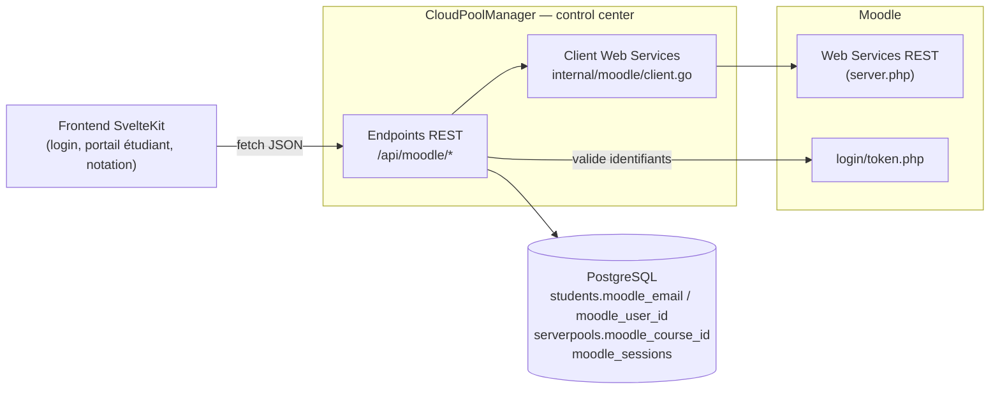
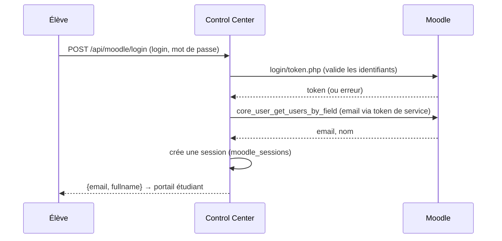

# Intégration Moodle

Cette intégration relie CloudPoolManager au **Moodle de l'établissement** pour trois usages :

1. **Importer la liste des élèves** d'un cours Moodle et les inscrire automatiquement à un pool de VMs.
2. Permettre aux élèves de **se connecter avec leur compte Moodle** (en plus de GitHub / SSO).
3. **Remonter les notes** nbgrader vers le carnet de notes Moodle.

Tout repose sur les **Web Services REST** de Moodle (authentifiés par un *token*) et sur le point
d'entrée `login/token.php` pour valider les identifiants. L'intégration est pensée pour passer du
Moodle local de développement au Moodle de l'école **en changeant uniquement deux variables**
(`MOODLE_URL` et `MOODLE_TOKEN`).

> ### ⚠️ Au déploiement : accès en LECTURE SEULE
> En production, l'établissement n'accordera très probablement qu'un **token en lecture seule**.
> Conséquences :
> - ✅ **Fonctionne** : import des élèves, lecture des cours/inscriptions, connexion via Moodle
>   (`login/token.php` ne nécessite pas d'écriture).
> - ❌ **Ne fonctionnera pas sans accès en écriture** : la **remontée des notes**
>   (`mod_assign_save_grade` est une opération d'écriture). Le bouton « Envoyer les notes vers
>   Moodle » renverra simplement une erreur côté serveur, sans rien casser d'autre.
>
> Autrement dit : **conçu pour fonctionner en lecture seule**. Le push de notes est un bonus qui
> ne s'activera que si l'école fournit un token avec les droits d'écriture (`mod_assign_save_grade`).
> En lecture seule, l'enseignant continue d'**exporter le CSV** des notes nbgrader et de le
> téléverser manuellement dans Moodle.

---

## Architecture



- **Client Go** : `control_center/internal/moodle/client.go` (un wrapper minimal des Web Services).
- **Endpoints REST** : `control_center/grpc/moodle.go` (routés dans `grpc/server.go`).
- **Données** : 3 ajouts au schéma (voir plus bas).

> **L'email est la clé d'identité universelle.** C'est lui qui relie : compte Moodle ↔ ligne
> `students` ↔ identifiant nbgrader ↔ utilisateur Moodle pour la remontée des notes. Lors de
> l'import, on pose `students.name = email` pour que cette chaîne soit cohérente de bout en bout.

---

## Configuration

Deux variables d'environnement (dans `.env` racine **et** `control_center/.env`, gitignorés) :

```
MOODLE_URL=https://moodle.exemple.fr      # racine du Moodle (sans slash final)
MOODLE_TOKEN=xxxxxxxxxxxxxxxxxxxxxxxxxxxx  # token Web Services (secret)
```

Si ces variables sont absentes, toute la fonctionnalité Moodle est **désactivée proprement**
(`moodle.Configured()` renvoie `false`) : les onglets/boutons Moodle n'apparaissent pas dans l'UI.

### Fonctions Web Services utilisées

| Fonction | Usage | Lecture/écriture |
|----------|-------|------------------|
| `core_course_get_courses_by_field` | lister les cours¹ | lecture |
| `core_enrol_get_enrolled_users` | élèves inscrits à un cours | lecture |
| `core_user_get_users_by_field` | retrouver l'email d'un utilisateur (par login) | lecture |
| `core_webservice_get_site_info` | info de session (sanity check) | lecture |
| `login/token.php` | valider les identifiants (connexion) | lecture |
| `mod_assign_get_assignments` | lister les devoirs d'un cours | lecture |
| `mod_assign_save_grade` | **écrire** une note | **écriture** ⚠️ |

¹ `core_course_get_courses` plante sur un verrou de cache avec certaines installations ; on utilise
donc `..._by_field`.

---

## Modèle de données (ajouts)

| Table / champ | Rôle |
|---------------|------|
| `students.moodle_email` | email Moodle de l'élève (clé de jointure VM↔élève, notes↔élève) |
| `students.moodle_user_id` | id numérique Moodle (pour `mod_assign_save_grade`) |
| `serverpools.moodle_course_id` | cours Moodle lié au pool (0 = aucun) |
| table `moodle_sessions` | session légère après login Moodle (id, email, fullname, role) |

Tout est créé par l'AutoMigrate GORM (`config/database.go`).

---

## 1) Import des élèves d'un cours

**Côté prof :** un pool → bouton **« Étudiants »** → onglet **« Moodle »** → choisir un cours →
cocher les élèves → **Importer**.

- `GET /api/moodle/courses` — liste des cours (pour le sélecteur).
- `GET /api/moodle/enrolments?course_id=X` — élèves inscrits (aperçu).
- `POST /api/moodle/import` `{pool_id, user_id, course_id, emails?}` — crée une ligne `students`
  par élève (`name = email`, `moodle_email`, `moodle_user_id`), **sans clé SSH**, et mémorise
  `serverpools.moodle_course_id`. **Idempotent** (ne duplique pas).

On peut aussi lier un pool à un cours sans importer (pour la remontée de notes) :
`POST /api/moodle/link-pool` `{pool_id, user_id, course_id}`.

---

## 2) Connexion via Moodle (élèves)

**Côté élève :** page de connexion `/` (ou portail `/student`) → **« Se connecter avec Moodle »**
→ identifiant + mot de passe Moodle.



- `POST /api/moodle/login` — valide via `login/token.php`, récupère l'email via le **token de
  service** (le token utilisateur n'a pas accès à la lecture des emails), crée une session.
  C'est un **flux étudiant** : les enseignants/admins utilisent le SSO Polytechnique (OIDC).
- `GET /api/moodle/my-pools?email=` — les pools où cet email est inscrit.
- `POST /api/moodle/attrib-vm` `{pool_id, user_id, email}` — attribue une VM **sans clé SSH**
  (`attribvm.AttribVMByEmail`). L'accès se fait par **JupyterLab** (navigateur) et le **terminal
  Guacamole** (clé gérée côté plateforme) ; aucune clé personnelle n'est requise. Même exclusion
  de la VM enseignant que le flux par clé SSH.
- Clé SSH **optionnelle** : `POST /api/moodle/ssh-key` `{email, ssh_key}` (page « Mon compte »)
  pour ceux qui veulent du SSH direct.

---

## 3) Remontée des notes ⚠️ (écriture — voir l'encart en tête)

**Côté prof :** page **Notation** → noter (collecter + notation auto) → choisir le **devoir Moodle
cible** → **« Envoyer les notes vers Moodle »**. Option : envoi automatique après chaque notation.

- `GET /api/moodle/assignments?pool_id=&user_id=` — devoirs (mod_assign) du cours lié au pool.
- `POST /api/moodle/push-grades` `{pool_id, user_id, assignment, moodle_assign_id}` :
  1. lit les notes nbgrader (`fetchNbgraderGrades`, qui réutilise `nbgrader export`),
  2. ignore les non-rendus (`status == missing`),
  3. mappe `email → moodle_user_id`,
  4. met à l'échelle `note = score / max_score × barème du devoir Moodle`,
  5. appelle `mod_assign_save_grade` pour chaque élève.
- Lien **« Carnet de notes Moodle ↗ »** (deep-link) + **« Moodle »** dans le menu.

**En lecture seule, cette étape échoue** (write refusé) → utiliser **Exporter CSV** + import manuel
dans Moodle.

---

## Endpoints REST (récap)

| Méthode + route | Rôle | Écriture Moodle ? |
|-----------------|------|-------------------|
| `GET /api/moodle/status` | Moodle configuré ? (+ URL) | — |
| `GET /api/moodle/courses` | liste des cours | non |
| `GET /api/moodle/enrolments?course_id=` | élèves d'un cours | non |
| `POST /api/moodle/import` | importer des élèves dans un pool | non |
| `POST /api/moodle/link-pool` | lier un pool ↔ un cours | non |
| `POST /api/moodle/login` | connexion élève | non |
| `GET /api/moodle/session?id=` | identité d'une session | non |
| `GET /api/moodle/my-pools?email=` | pools de l'élève | non |
| `POST /api/moodle/attrib-vm` | attribuer une VM (sans clé) | non |
| `POST /api/moodle/ssh-key` | ajouter une clé SSH (optionnel) | non |
| `GET /api/moodle/assignments` | devoirs d'un cours | non |
| `POST /api/moodle/push-grades` | **remonter les notes** | **OUI** ⚠️ |

→ **Tout est en lecture sauf `push-grades`.** Sans droit d'écriture, seul ce dernier est indisponible.

---

## Moodle local de développement

`moodle/` contient un **Moodle complet** (Docker) pour développer sans dépendre du Moodle de l'école.
Voir `moodle/README.md`.

```bash
cd moodle && cp .env.example .env && docker compose up -d   # ~quelques min au 1er boot
cd .. && scripts/moodle-bootstrap.sh
```

Le bootstrap (idempotent) : active les Web Services + REST, crée un **service dédié** + un **token**,
crée 2 cours de démo, 4 élèves + 1 prof + inscriptions, 1 devoir par cours, et écrit
`MOODLE_URL`/`MOODLE_TOKEN` dans `.env` (racine + `control_center/.env`).

UI : http://localhost:8081 (admin / `MOODLE_ADMIN_PASSWORD`). Comptes de démo : `alice`, `bob`,
`charlie`, `diana`, prof `prof1` — mot de passe `Student_2026!`.

> **Le Moodle local sert UNIQUEMENT au développement** : il a un token admin (lecture + écriture),
> ce qui permet de tester aussi la remontée des notes. Le déploiement réel, lui, sera lecture seule.

---

## Pièges techniques (mémo)

- Images **`bitnamilegacy/`** : Bitnami a déplacé ses tags versionnés vers ce namespace en 2025.
- `core_course_get_courses` → verrou de cache ; utiliser `core_course_get_courses_by_field`.
- `login/token.php` exige le **service mobile activé** côté Moodle.
- L'email se lit via le **token de service** (le token utilisateur n'y a pas accès).
- `mod_assign_get_assignments` filtre par inscription → en dev, l'admin est **inscrit enseignant**
  dans chaque cours par le bootstrap.
- Perms **`moodledata`** rendues inscriptibles **après** le bootstrap (les WS créent des dossiers
  temporaires) — dev uniquement.

## Sécurité

- `MOODLE_TOKEN` et les mots de passe Moodle sont **gitignorés** (`*.env`) ; le dépôt ne contient
  que des `.env.example`.
- En production, demander à la DSI un **token de service dédié, en lecture seule**, limité aux
  fonctions listées (sans `mod_assign_save_grade` sauf si la remontée de notes est souhaitée).
