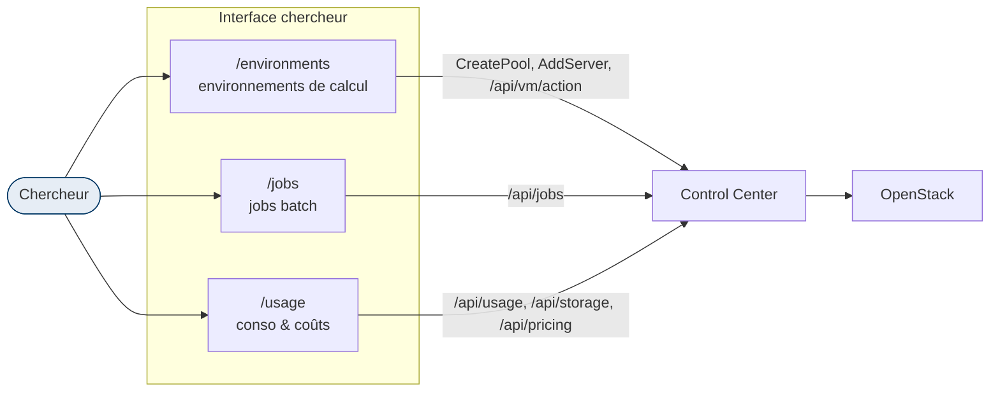

# Interface chercheur — self-service de calcul

La plateforme sert deux publics avec la **même base** mais des interfaces distinctes par rôle :
l'enseignement (cours, étudiants, notation) et la **recherche/calcul**. Le rôle `chercheur`
dispose d'une interface **self-service** dédiée : il crée et pilote ses propres environnements
de calcul, lance des jobs batch et suit sa consommation — sans voir le volet éducation.

## Vue d'ensemble

Le chercheur ne voit **que** ces trois entrées de menu (Environnements · Jobs · Conso).
Tout le volet éducation (notation nbgrader, cours, roster d'élèves, import Moodle/cours de l'X,
inventaire global) lui est **masqué**.

## 1. Environnements de calcul — `/environments`

Un « environnement » est un **serverpool** en mode calcul. La page (`frontend/src/routes/environments/+page.svelte`) permet de :

- **Créer un environnement** (bouton « Nouvel environnement ») : image, gabarit (flavor —
  vCPU/RAM, badge **GPU** détecté via les `extra_specs` OpenStack), nombre de machines.
  Par défaut `compute_mode = true` (SSH/terminal, sans Jupyter).
- **Piloter chaque machine** : démarrer / arrêter (`POST /api/vm/action`), voir l'IP + la
  commande `ssh vmuser@<ip>` (copiable), ouvrir le **terminal navigateur** (Guacamole).
  Pour un environnement non-calcul, boutons **Jupyter** / **VS Code** (proxy authentifié).
- **Ajouter une machine** au pool, **supprimer** l'environnement.

Les VMs sont rattachées à leur environnement via `metadata.serverpool_id` (ou le préfixe de nom).

## 2. Jobs batch — `/jobs`

Soumission et suivi de jobs (script exécuté sur une VM du pool) :

- Job simple : nom, pool, script, priorité, `auto_stop`.
- **Balayage de paramètres** (*sweep*) : un job par valeur d'un paramètre.
- **Cluster** : `nodes > 1` (forcément éphémère — pool transitoire créé puis détruit).
- Suivi : statut (queued → running → succeeded/failed/canceled), logs, `rerun`/`cancel`.

## 3. Consommation & coûts — `/usage`

Réutilise les endpoints d'accounting, **bornés aux données du chercheur** (ses pools) :
heures-VM et coût estimé du mois (`/api/usage`), stockage alloué et quota (`/api/storage`),
tarifs unitaires (`/api/pricing`). Voir [Observabilité](10-observabilite.md) pour les métriques.

## 4. Modèle d'autorisation (sécurité)

L'interface chercheur repose sur un **gating par rôle** + un **scoping par propriétaire** —
détaillé dans [Sécurité](13-securite.md). En résumé :

- **HTTP** (`control_center/grpc/httpauth.go`) : `researcherHTTPPrefixes`
  (`/api/jobs`, `/api/usage`, `/api/storage`, `/api/pricing`) + `/api/vm/action` sont ouverts
  au **staff ET au chercheur**, jamais à l'étudiant. Les routes admin/éducation
  (`/api/inventory`, `/api/nbgrader/*`, `/api/moodle/*`, `/api/pool/*`, `/api/vm/rebuild|resize`)
  restent **staff uniquement**.
- **gRPC** : `CreatePool`/`AddServer`/`ConfigService.*` sont autorisés au chercheur (méthodes
  sensibles refusées au seul rôle `student`).
- **Anti-IDOR** : un chercheur n'agit que sur **ses** ressources — soumission de job et
  balayage bornés à un pool qu'il possède (`poolOwnedByCallerOrStaff`), pilotage VM borné à
  ses serveurs (`serverOwnedByCallerOrStaff`), terminal/proxy bornés à ses VMs
  (`ipBelongsToCaller`, étendu au propriétaire du serveur).

## 5. Attribuer le rôle `chercheur`

Via la console admin (`/admin`) ou `POST /api/admin/users/role` avec `{email, role:"chercheur"}`.
Le rôle est ensuite résolu depuis la base à chaque authentification (`resolveRole`).

## Fichiers de référence

| Élément | Fichier |
|---|---|
| Page environnements | `frontend/src/routes/environments/+page.svelte` |
| Nav / accueil par rôle | `frontend/src/routes/+layout.svelte`, `frontend/src/routes/home/+page.svelte` |
| Gating HTTP | `control_center/grpc/httpauth.go` |
| Helpers d'appartenance | `control_center/grpc/inventory.go` |
| Jobs (scoping pool) | `control_center/grpc/batch_jobs.go` |
| Pilotage VM (scoping serveur) | `control_center/grpc/vm_actions.go` |
