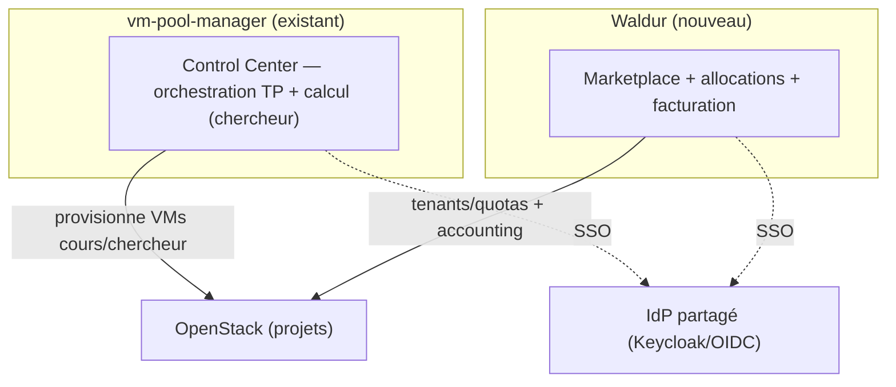

# Waldur — accounting, marketplace & allocations sur OpenStack

Objectif : **utiliser le vrai Waldur** (et non une comptabilité maison) comme couche de
**comptabilité / facturation / allocation / marketplace** au-dessus de nos projets OpenStack.
Le calcul de coût interne (`/api/usage`, métriques `cpm_*`, dashboard « Coûts ») reste **utile
pour l'exploitation et les alertes**, mais Waldur devient la **référence** pour l'accounting.

Sources : [waldur.com](https://waldur.com/) ·
[déploiement docker-compose](https://docs.waldur.com/latest/admin-guide/deployment/docker-compose/) ·
[plugin OpenStack](https://docs.waldur.com/latest/developer-guide/plugins/openstack/).

## Pourquoi Waldur (vs maison)

Plateforme open-source mature (utilisée par des centres de calcul / NREN) qui apporte, prêt à
l'emploi, ce qu'on ne veut pas réécrire : **marketplace** d'offres, **projets/organisations**,
**allocations & quotas**, **comptabilité et facturation** (périodes clôturées, factures),
**rapports d'usage**, workflows d'approbation, et une **intégration OpenStack native**
(tenants, instances, volumes, réseaux, quotas, découverte d'images/flavors).

## Architecture & déploiement

Waldur se déploie **séparément** (son propre dépôt / Helm) — ne pas le mêler à la stack
`monitoring/`. Composants : **MasterMind** (API Django + workers Celery + beat), **PostgreSQL**,
**Redis**, **HomePort** (frontend), **Keycloak** (IdP) et **Caddy** (reverse-proxy). Prérequis :
VM dédiée **≥ 8 Go RAM**, Docker.

```bash
git clone https://github.com/waldur/waldur-docker-compose.git
cd waldur-docker-compose
cp .env.example .env                     # renseigner domaine, secrets, SMTP…
docker compose up -d                      # migrations initiales : quelques minutes
# compte admin + catégories marketplace
docker exec -t waldur-mastermind-worker waldur createstaffuser -u admin -p '<motdepasse>' -e admin@polytechnique.edu
docker exec -t waldur-mastermind-worker waldur load_categories vpc vm storage
```

Accès : HomePort `https://<host>/`, API `https://<host>/api`, santé `/health-check`.
Pour la prod : Helm chart `waldur-helm` (k8s) plutôt que docker-compose (prévu « démo »).

## Intégration à NOTRE OpenStack

Dans Waldur, créer une **offre Marketplace de type `OpenStack.Tenant`** avec des identifiants
**admin** OpenStack (idéalement une *application credential* dédiée, pas un mot de passe perso) :

| Paramètre (`secret_options`) | Valeur |
|------------------------------|--------|
| `backend_url` | endpoint Keystone v3 (`https://<keystone>:5000/v3`) |
| `username` / `password` | application credential (id/secret) ou compte admin |
| `tenant_name` | projet admin |
| `domain` | domaine Keystone v3 |
| `external_network_id` | UUID du réseau externe (IP flottantes) |

Flux : les utilisateurs **commandent un tenant** → Waldur provisionne le projet OpenStack +
quotas ; puis commandent **instances/volumes** via les offres auto-créées. Des tâches de fond
**synchronisent quotas/images/état** et peuvent **importer les ressources existantes** pour la
comptabilité. → Waldur mesure et **facture** la consommation réelle.

## Place dans vm-pool-manager



- **Waldur = couche accounting/allocation/marketplace** ; le control center continue d'orchestrer
  les VMs de cours et le self-service chercheur.
- **SSO** : faire pointer Waldur (Keycloak) et notre auth (Dex/OIDC) sur le **même annuaire**
  (LDAP établissement) pour une identité unique.
- **Comptabilité** : Waldur devient la référence (factures/allocations) ; les métriques `cpm_*`
  et le dashboard « Coûts » restent une **vue exploitation rapide** (interim/complément).

## Décisions à prendre (avant déploiement)

1. **Périmètre** : Waldur gère-t-il uniquement les projets **recherche**, ou aussi l'enseignement ?
2. **Modèle d'accès** : les chercheurs commandent-ils leur compute **via le marketplace Waldur**
   (allocations/quotas/facturation), l'interface `/environments` restant pour l'usage courant ?
3. **Identité** : SSO partagé (Keycloak ↔ Dex ↔ LDAP) ou comptes séparés ?
4. **Facturation** : tarifs par flavor/projet, périodes de facturation, destinataires des factures.
5. **Infra** : VM dédiée ≥ 8 Go, DNS + TLS, *application credential* OpenStack, `external_network_id`.

## Scaffolding fourni

Le dossier [`waldur/`](../waldur/) contient un `README` + un `.env.example` d'intégration
(paramètres OpenStack/IdP à renseigner) et un exemple d'offre `OpenStack.Tenant`. Il **référence**
le dépôt officiel `waldur-docker-compose` (on ne recopie pas son compose, versionné chez eux).

> ⚠️ Déploiement non réalisé ici (accès infra requis + VM dédiée). Ce document + le scaffolding
> sont le plan d'exécution ; l'installation se fait quand une VM et les identifiants OpenStack
> sont disponibles.
