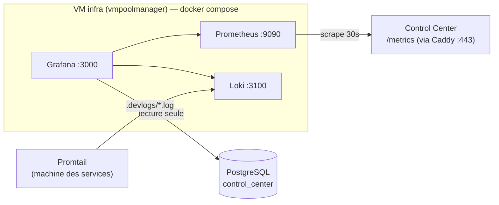

# Observabilité — Grafana + Prometheus + Loki + Tempo + OTel Collector

Stack de supervision (Grafana + Prometheus + Loki + Promtail + **Tempo** + **OTel Collector**).

## OpenTelemetry (traces + métriques + logs)

Les deux services Go (control center + microservice OpenStack) sont instrumentés OTel
(HTTP via `otelhttp`, gRPC via `otelgrpc`, SQL via le plugin GORM, logs via `slog`) et
exportent en **OTLP/gRPC** vers l'**OTel Collector**, qui répartit :

```
services Go ──OTLP:4317──▶ otel-collector ─┬─ traces ──▶ Tempo  (:3200)
                                           ├─ métriques ▶ :8889 ─ scrapé par Prometheus
                                           └─ logs ─────▶ Loki  (/otlp)
                                                          Grafana lit Tempo+Loki+Prometheus
```

- Activer l'export côté service : `OTEL_EXPORTER_OTLP_ENDPOINT=http://<collector>:4317`
  (+`OTEL_EXPORTER_OTLP_INSECURE=true` sans TLS). **Le scheme `http://` est obligatoire.**
  Vide → télémétrie **désactivée** (no-op, aucun blocage au démarrage).
- En dev (services natifs, collector docker) : `http://localhost:4317`.
- Corrélation dans Grafana : trace ↔ logs (via `trace_id`), datasources **Tempo** et **Loki**
  provisionnées. Rétention traces : 7 j (Tempo), métriques 90 j (Prometheus).

> ⚠️ **Topologie selon l'environnement.** La stack doit tourner **là où elle atteint le
> Control Center (`/metrics`) et PostgreSQL**.
> - **Dev** : ces services tournent sur la machine de dev (derrière NAT/VPN, PG en `localhost`).
>   Une VM du projet `vmpoolmanager` **ne les route pas** (testé : timeout). → On déploie la
>   stack **sur la machine de dev** (`docker compose up -d`, voir « Déploiement local »).
> - **Prod** : quand le Control Center tourne sur un hôte joignable depuis `vmpoolmanager`,
>   on déploie sur une **VM infra** (voir « Déploiement sur la VM infra »).



## Ce qu'on mesure

**Métriques d'état** (Control Center `/metrics`, requêtées en base à chaque scrape) :
`cpm_pools_total`, `cpm_servers{status}`, `cpm_vms_active`, `cpm_students_total`,
`cpm_github_sessions_24h`, `cpm_pool_students{pool,owner}`, `cpm_batch_jobs{status}`,
`cpm_vm_instances_total`, `cpm_vm_registrar_stale`, `cpm_month_cost`, `cpm_month_vm_hours`,
`cpm_pool_month_cost{pool,owner}`, `cpm_storage_allocated_gb`, `cpm_storage_quota_gb`.

**Métriques d'événement** (compteurs/histogrammes) :
- Control Center : `cpm_vm_attribution_total{result}`, `cpm_proxy_sessions_total{kind}`,
  `cpm_batch_jobs_processed_total{result}`, `cpm_batch_job_duration_seconds`,
  `cpm_vm_action_total{action,result}`.
- Microservice OpenStack (nouveau `/metrics` dédié, port `METRICS_PORT` défaut `:50053`) :
  `cpm_vm_provision_total{result}`, `cpm_vm_provision_duration_seconds`,
  `cpm_openstack_errors_total{operation}`.

**Infra** : `node-exporter` (hôte) + `cAdvisor` (conteneurs) ajoutés à la stack.
**Traces/logs** : OTel → Tempo (traces) + Loki (logs), corrélés par `trace_id`.
**Données métier** : datasource PostgreSQL lecture seule (dont `vm_usage` pour la comptabilité).

Dashboards provisionnés automatiquement :
- **CloudPoolManager — Usage** (occupation, pools, logs).
- **CloudPoolManager — Santé plateforme** (services up/down, provisioning, jobs, erreurs
  OpenStack, attribution, sessions proxy, hôte).
- **CloudPoolManager — Coûts & comptabilité** (coût du mois, heures-VM, coût par pool,
  stockage vs quota, **table de comptabilité par utilisateur** — inspiration Waldur).

## Alerting (Alertmanager + e-mail SMTP)

- **Alertmanager** (`:9093`) route les alertes déclenchées par Prometheus vers l'**e-mail**.
- Règles : `prometheus/rules/alerts.rules.yml` (services down, échecs/lenteur de provisioning,
  erreurs OpenStack, échecs d'attribution/jobs, VMs périmées ou en ERROR, dépassement de quota,
  coût mensuel, disque/mémoire/charge hôte).
- **SMTP à renseigner** dans `alertmanager/alertmanager.yml` (`smtp_*`) + les adresses `to:`
  des receivers `email-default` (warning/info) et `email-critical` (critique). Valeurs
  suggérées dans `.env.example` (Alertmanager ne substitue pas les variables d'env → recopier).
- **Valider avant déploiement** :
  ```bash
  docker run --rm -v "$PWD/prometheus":/p prom/prometheus:v2.53.0 promtool check rules /p/rules/alerts.rules.yml
  docker run --rm -v "$PWD/prometheus":/p prom/prometheus:v2.53.0 promtool check config /p/prometheus.yml
  docker run --rm -v "$PWD/alertmanager":/a prom/alertmanager:v0.27.0 amtool check-config /a/alertmanager.yml
  ```

## Comptabilité (accounting, inspiration Waldur)

Le socle « qui consomme quoi et combien » est en place : `vm_usage` (heures-VM pondérées
vCPU/RAM par VM et par mois) + calcul de coût (`GET /api/usage`, tarifs `PRICE_*`), exposés
en **métriques Prometheus** (`cpm_month_cost`, `cpm_pool_month_cost`) et en **table Grafana**
par utilisateur/mois. Pistes pour se rapprocher de Waldur : persister des coûts par période
clôturée (facturation), tarifs par flavor/projet, et une notion d'allocation/quota par projet.

## Déploiement local (machine de dev) — recommandé pour le dev

Prérequis : Docker (Colima ou Docker Desktop) + le Control Center qui tourne (`task control`
ou `dev.sh`, donc `/metrics` sur `:50055`) + PG accessible en `localhost:5432`.

```bash
cd monitoring
cp .env.example .env        # mettre GF_ADMIN_PASSWORD ; pour le dev, CPM_PG_* = identifiants PG du .env racine
docker compose up -d        # docker-compose.override.yml (gitignoré) branche host.docker.internal
```

- Grafana : http://localhost:3000 (admin / `GF_ADMIN_PASSWORD`)
- Le fichier `docker-compose.override.yml` (non commité) : Prometheus scrape
  `host.docker.internal:50055`, Grafana atteint le PG du Mac via `host.docker.internal`,
  Promtail lit `../.devlogs/*.log` et pousse vers Loki. La config Prometheus de dev est
  `prometheus/prometheus.dev.yml`.

## Déploiement sur la VM infra (prod)

1. **Provisionner** une VM Ubuntu dans `vmpoolmanager` (réseau `public-2`), installer Docker.
2. **Créer l'utilisateur PostgreSQL lecture seule** (depuis une machine qui atteint la base) :
   ```bash
   psql "$POSTGRES_DSN" -f monitoring/grafana_ro_user.sql   # adapter le mot de passe
   ```
3. **Copier** `monitoring/` sur la VM, créer `.env` depuis `.env.example` (renseigner mots de
   passe + `CPM_PG_HOST`).
4. **Lancer** :
   ```bash
   cd monitoring && docker compose up -d
   ```
5. Accès Grafana : `http://<IP-VM-infra>:3000` (admin / `GF_ADMIN_PASSWORD`).

## Accès à `/metrics` (scrape INTERNE)

⚠️ Depuis l'audit Acunetix, `/metrics` est **bloqué (404) côté Caddy public** (fuite d'info
Prometheus). Prometheus ne doit donc **pas** passer par le domaine : il scrape les endpoints
**internes**, joignables depuis la VM d'observabilité :
- Control Center : `<ip-interne>:50055/metrics` (job `control-center`).
- Microservice OpenStack : `<ip-interne>:50053/metrics` (job `openstack-microservice`,
  variable `METRICS_PORT`).

Adapter les `targets` dans `prometheus/prometheus.yml`. Ces ports ne doivent être ouverts
qu'au réseau interne (security group), jamais exposés sur Internet.

## Logs (Promtail, sur la machine des services)

```bash
cd monitoring/promtail
LOKI_HOST=<IP-VM-infra> docker compose -f docker-compose.promtail.yml up -d
```

## Sécurité ⚠️

- L'utilisateur PostgreSQL est **SELECT-only** (`grafana_ro`).
- `/metrics` est exposé via Caddy : contenu = compteurs d'usage (peu sensible) ; on peut le
  protéger par un token / basic-auth ultérieurement.
- Changer `GF_ADMIN_PASSWORD`. Idéalement, mettre Grafana derrière un reverse proxy + auth.
